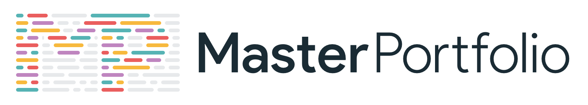

<p align="center"> 
    </img>
</p>

<h1 align="center">Hrutvik's Software Developer Portfolio 🔥</h1> 
<h3 align="center">This is a personal portfolio to showcase my skills and experiences.</h3>

<p align="center">
  <a href="https://nodejs.org/en/blog/release/v20.11.1"></a>
  <a href="https://www.npmjs.com/package/npm/v/10.2.4"></a>
  <a href="https://reactjs.org/"></a>
</p>

---

## Sections 📚

✔️ Summary and About Me  
✔️ Skills  
✔️ Projects  
✔️ Experience  
✔️ Education  
✔️ Contact Me

## How to Run the Project Locally 📋

- **Requirements**: Make sure you have `Node.js` and `npm` installed on your system (versions 20.11.1 and 10.2.4, respectively, or higher).
- **Clone the repository**:
  ```bash
  git clone https://github.com/hsalunkhe14/your-portfolio.git
  ```

Customization ✏️
To make this portfolio your own, you can customize the following:

Personal Information
Navigate to src/portfolio.js and modify the personal details, such as name, skills, experience, education, etc.
Change the social media links and other details in src/socialMediaLinks.js.

Theme Customization
You can edit the colors and styles in src/theme.js to customize the theme of the portfolio.
Add Your Own Logo
Replace the logo by updating the image files in public/images/. You can also adjust the logo animation or remove the splash screen in src/Loader.js.

Deployment 📦
Once you've finished customizing, you can deploy your portfolio. I recommend using GitHub Pages for simplicity. To deploy:

Run npm run build to create a production build of your site.
Push the contents of the build folder to your GitHub repository.
Enable GitHub Pages in your repository settings.
Technologies Used 🛠️
React: Front-end framework for building the portfolio.
JavaScript: Core programming language.
CSS: Styling the website.
HTML5: Structuring the website.
